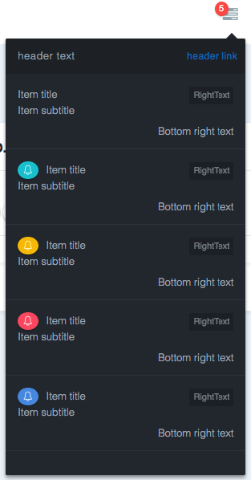
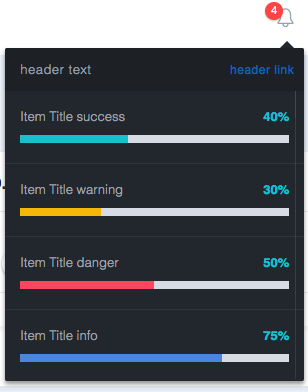

## How to use headerList:
 
### 1- Create a service 

1.1 - Create a service whose class implements the interface Randock\MetronicBundle\HeaderBuilder\HeaderList\Definition\HeaderListInterface; and tagged as name: metronic.header_dropdown_list

Example: 
```yaml
  metronicbundle.headerlist.2:
    class: Randock\Infrastructure\TaskBundle\HeaderList\TaskList
    arguments:
        - '@security.token_storage'
        - '@router'
        - '@translator'
    tags:
        - { name: metronic.header_dropdown_list, priority: 10 }
```

The priority is used to determine in which order the services will be called. The lower the number the earlier the service will be rendered. It will be rendered from left to right.


  
1.2 Functions of the class:
- getType: Should return a string that will have as value HeaderListInterface::NOTIFICATION or HeaderListInterface::TASK depending on which type of headerList we want (you can see screenshots of the types later in this document)
 
- getItems() (Notification): Should return an array of NotificationHeaderListItem objects that can have the next attributes:
  - title →  text of the first line of the element of the list
  - subtitle → text of the second line of the element of the list
  - url → The url to which we will be redirected after clicking on the header link
  - rightText → text that will be shown at the right of the title with a special format 
  - icon → icon that will be at the left of the title
  - iconType→ type of the icon, it will set the icon background. 
  Can have the values → {NotificationHeaderListItem::SUCCESS, NotificationHeaderListItem::WARNING, 
  NotificationHeaderListItem::INFO, NotificationHeaderListItem::DANGER}
  - bottomRightText→ Text that will be at the bottom right corner.



- getItems() (Task): Should return an array of TaskHeaderListItem objects that can have the next attributes:
  - title →  text of the first line of the element of the list
  - url → The url to which we will be redirected after clicking on the header link
  - percentage → Will be shown in text on the right and in the progress bar
  - progressBarType → The progress bar type. It can have the values → {TaskHeaderListItem::SUCCESS, TaskHeaderListItem::WARNING, 
                                                                         TaskHeaderListItem::INFO, TaskHeaderListItem::DANGER}




  - getOptions:
No option is required. If they are not passed, the default value will be used.
Example:
```php
[
    'dark' => 'true',
    'icon' => 'icon-bell',
    'header' => [
        'text' => $this->translator->transChoice(
            randock.artworkdash.task_list|randock.artworkdash.task_list_plural',
            count($tasks = $this->getTasks())
        ),
        'backgroundColor' => '#4D2A2A',
        'color'=> '#A8DCB7',
        'link' =>[
            'text' => 'View all',
            'url' => $this->router->generate('randock_artworkdash_dashboard_home'),
            'color'=> '#A8DCB7'
        ],
    ],
    'height' => '200px',
    'scrollColor' => '#637283'
];
```
- dark: If it's set, the dark theme that comes in metronic will be used. If it does not appear, the light will be used. (It defines the color palette)
 
- icon: it must have the necessary classes to represent an icon. Bootstrap and FontAwesome are supported.
 
- header:
  - text: The text that will appear in the header
  - backgroundColor: The header background color
  - color: The header text color
	
  - link:
    - text: The text of the link (should be short so that there is no display problems).
    - url: The url to which we will be redirected after clicking on the header link.
    - color: The color of the header link text
 
- height: The height of the headerList displayed
- scrollColor : The color of the scroll bar
 
 
